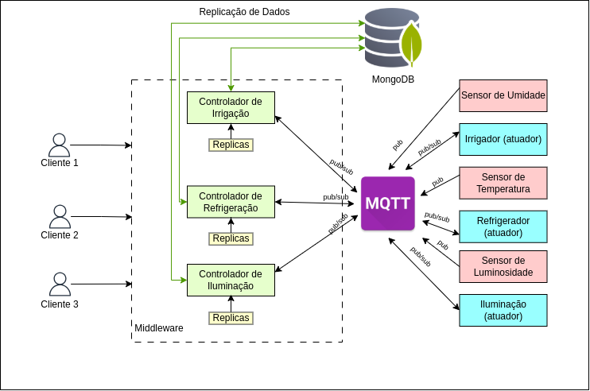
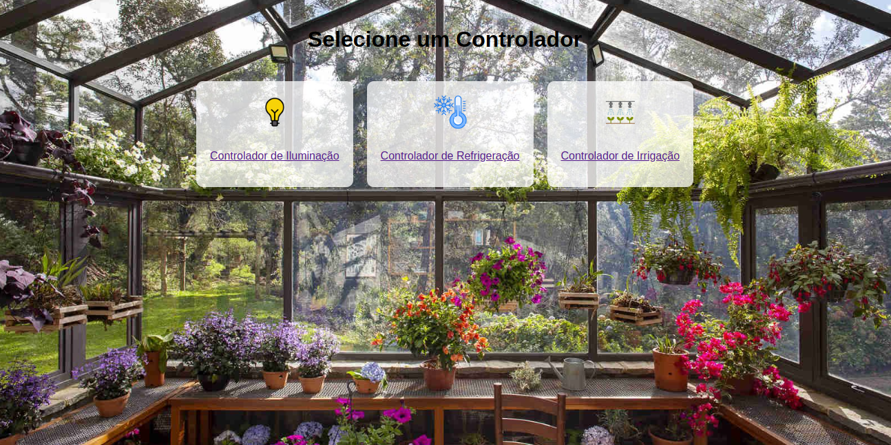
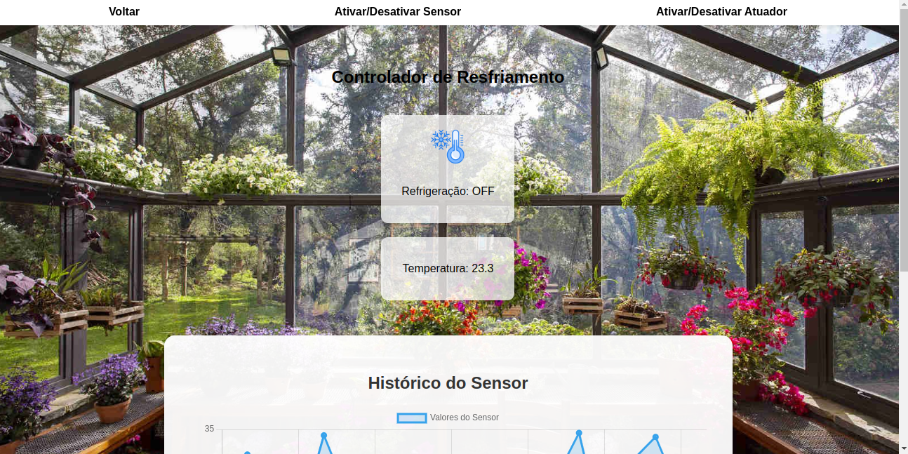
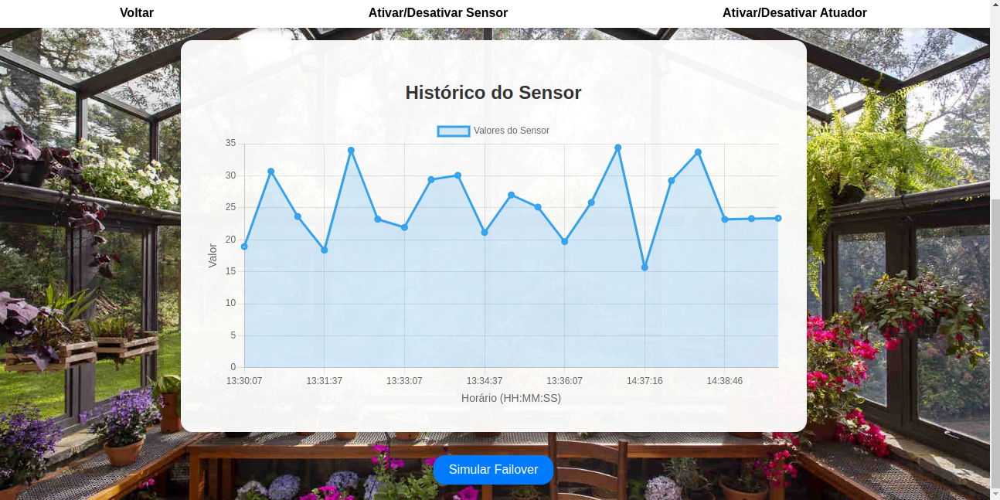
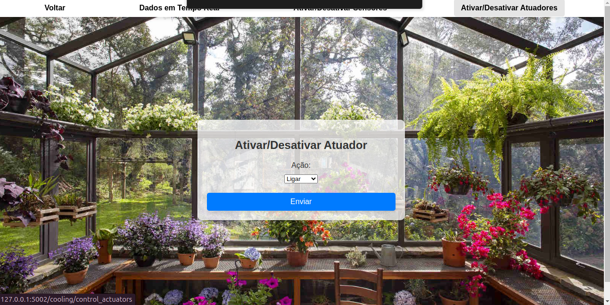
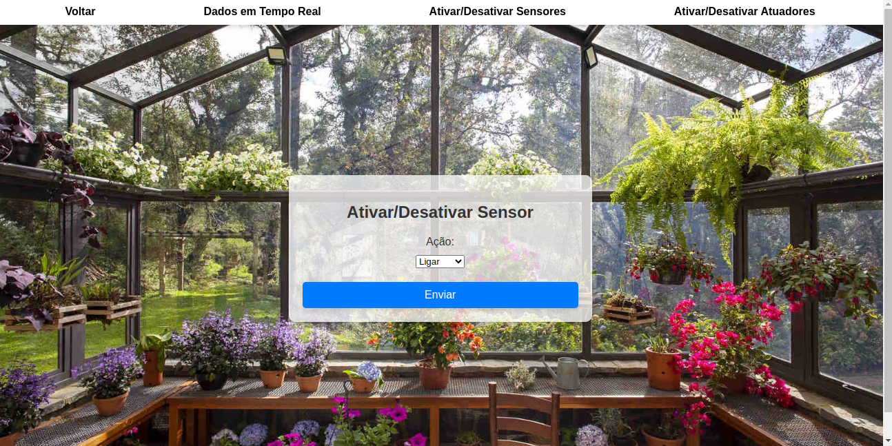

# **Agricultura Inteligente: Middleware para Sistemas Distribuídos**

## **Descrição do Projeto**

Este projeto implementa um sistema distribuído para **Agricultura Inteligente**, utilizando sensores, atuadores e controladores para gerenciar e automatizar processos agrícolas. O sistema é projetado para ser tolerante a falhas, com réplicas de controladores, validação de dados e um middleware central que gerencia a comunicação e a replicação.

O código foi desenvolvido em **Python** e utiliza tecnologias como **MQTT**, **MongoDB** e um middleware para comunicação entre os componentes.

---

## **Funcionalidades**

### 1. **Monitoramento e Automação**
   - Sensores capturam dados em tempo real:
     - **Umidade do solo**
     - **Temperatura**
     - **Luminosidade**
   - Atuadores executam comandos com base nos dados coletados:
     - Sistema de irrigação
     - Controle de temperatura
     - Iluminação automatizada

### 2. **Tolerância a Falhas**
   - Cada controlador possui uma réplica primária e duas réplicas secundárias.
   - Quando o controlador principal (**Primary**) falha, uma réplica é promovida automaticamente ao papel de **Primary**, garantindo a continuidade.

### 3. **Validação e Segurança**
   - Dados capturados pelos sensores são validados no middleware para evitar ações incorretas.
   - Caso um dado esteja fora do padrão, ele é descartado pelo middleware.

### 4. **Conexão de Vários Clientes**
   - Vários clientes podem se conectar ao sistema simultaneamente.
   - Cada cliente executa o arquivo `client.py` através do comando:
     ```bash
     PORT={num_porta} python3 client/client.py
     ```
   - Todos os clientes estão sincronizados e compartilham a mesma visão do sistema em tempo real.

### 5. **Interface para Clientes**
   - Clientes podem monitorar dados em tempo real, visualizar o estado dos atuadores e enviar comandos manuais para sensores e para os atuadores.

---

## **Arquitetura do Sistema**

A arquitetura do sistema é baseada em uma comunicação **pub/sub** utilizando MQTT, garantindo modularidade e facilidade de integração. 

---
### **Componentes Principais**
1. **Sensores e Atuadores**
   - **Sensores:** Publicam dados para tópicos MQTT.
   - **Atuadores:** Subscribem a tópicos MQTT para receber comandos dos controladores.

2. **Controladores**
   - Cada controlador gerencia sensores e atuadores específicos:
     - **Irrigação:** Baseado na umidade do solo.
     - **Refrigeração:** Baseado na temperatura ambiente.
     - **Iluminação:** Baseado na luminosidade.
   - Operam em um esquema **Primary-Replica**, com recuperação automática em caso de falha.

3. **Middleware**
   - Centraliza a comunicação entre os controladores, sensores, atuadores e clientes.
   - Gerencia réplicas e promove automaticamente uma réplica ao papel de **Primary** em caso de falha.

4. **Banco de Dados (MongoDB)**
   - Armazena os dados históricos capturados pelos sensores e o estado dos atuadores.

---

## **Tecnologias Utilizadas**

- **Python**: Linguagem principal do desenvolvimento.
- **MQTT**: Protocolo de comunicação pub/sub para troca de mensagens entre sensores, atuadores e controladores.
- **MongoDB**: Banco de dados para armazenamento de estados e logs.
- **Flask**: Para implementar a interface do cliente e o middleware.

---

## **Executando o Projeto**

### **Pré-requisitos**
1. Python 3.10 ou superior
2. Biblioteca Paho MQTT (`pip install paho-mqtt`)
3. MongoDB em execução

### **Passos**
1. Clone este repositório:
   ```bash
   git clone https://github.com/marimoreiraa/sd-middleware-smart-agro.git
   cd middleware-agricultura-inteligente
   ```
2. Instale as dependências:
   ```bash
   pip install -r requirements.txt
   ```
3. Inicie o middleware:
   ```bash
   python middleware_app.py
   ```
4. Execute o cliente, especificando uma porta:
   ```bash
   PORT={num_porta} python client/client_app.py
   ```
Nota: Todos os clientes estarão sincronizados, visualizando os mesmos dados e ações em tempo real.

5. Acesse a interface pelo navegador para monitoramento e controle (http://localhost:{num_porta}).

## Funcionalidades em Detalhes
1. Tela de escolha do Controlador

2. Tela de visualização de dados em tempo real

3. Gráfico de dados históricos e Botão de FailOver

3. Tela de controle de atuadores

4. Tela de controle de sensores



## Tolerância a Falhas

O sistema implementa um mecanismo de tolerância a falhas através da simulação de failover. Esta funcionalidade é acessível na página `controllers.html`, onde um botão permite acionar a simulação de falha de um controlador específico.

### Teste de Failover

1. **Acesso à Página**: Navegue até a página `controllers.html` onde os controladores estão listados.
2. **Simulação de Falha**: Ao clicar no botão de simulação de falha, a função `exposed_simulate_failover` do `middleware_app.py` é acionada. Esta função promove a próxima réplica do controlador como o novo controlador principal.
3. **Comportamento Esperado**: O controlador principal atual é interrompido, e a próxima réplica assume suas funções, garantindo que o sistema continue operando sem interrupções.

Este teste de failover é crucial para garantir a continuidade do serviço em caso de falhas nos controladores principais, demonstrando a robustez do sistema.
